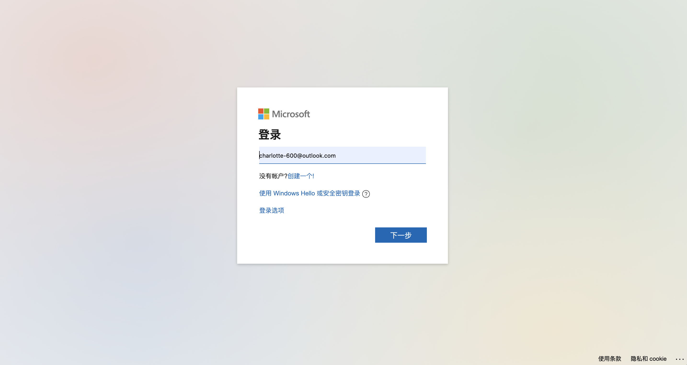
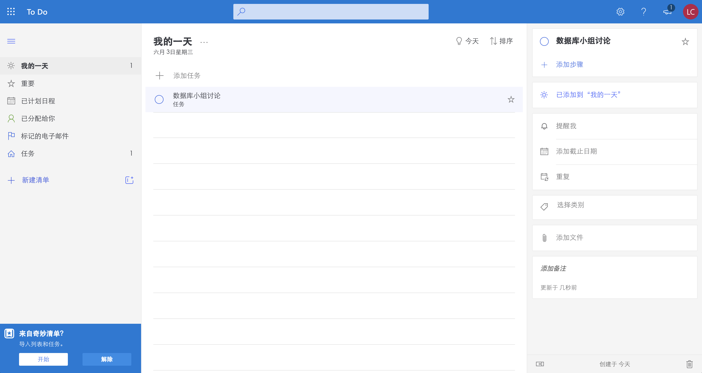
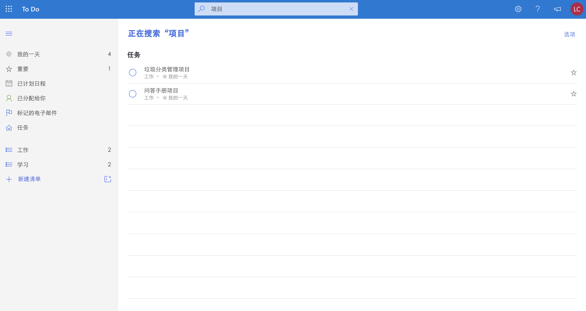

# todo 管理系统需求分析

```
要求
- 需要进行数据库概念设计和逻辑设计
- 系统中需要有内容的分类与标签属性
- 系统中需要有用户
- 要综合应用数据库的增、删、改、查等功能 
```

## 参考资料
- 需求分析
https://wenku.baidu.com/view/4f9b22a2b0717fd5360cdc6d.html
- Todo List简单实现
https://www.cnblogs.com/yimu/archive/2012/11/02/2750774.html

## 用户设置
1.	普通用户
2.	管理员

## 系统功能
1.	管理员管理用户信息（查看、新增、更改）
2.	用户注册、注销、登录、登出（找回密码?）
3.	用户新增 todo（类别、日期、内容、重要性、状态）
4.	用户查看 todo
5.	按照类别/日期/状态/重要性筛选 todo（按日期筛选可考虑日历形式）
6.	用户删除 todo、删除类别
7.	用户修改 todo（类别、日期、内容、重要性、状态）
8.	按照时间段/状态进行统计（进行中、已完成、已逾期）
9.	关联 todo，做完某个 todo 才能做下一个 todo（此功能暂时搁置）

```
清单：即 list，例如读书清单。用户可以使用系统自带类别，也可以自定义清单名称。  

内容：即 todo，例如读某本书。
```

## 数据库设计
- 用户信息表 user  
 | uid | INT（PK） |  
 | username | VARCHAR |  
 | password | VARCHAR |  
 | role | INT |  
 `role：0为管理员；1为普通用户`

- 任务信息表 todo
| tid | INT（PK）|  
| uid | INT（FK）|  
| ddl | VARCHAR |  
| create_date | VARCHAR |  
| content | VARCHAR |  
| importance | INT |  
| listname | lid (INT) |  
| status | INT |  
`importance：0为不重要；1为普通；2为重要`  
`status：0为进行中；1为已完成；2为已逾期`  
`清单名称：我的一天+自定义清单`  

-  todo关系表（暂时搁置）
| tid_1 | INT |  
| tid_2 | INT |  
| 关系 | INT |  
`关系：0为父子；1为兄弟；2为前后`  

- 清单表list
| lid | INT（PK）|  
| uid | INT（FK）|  
| listname | VARCHAR |  

## 任务划分
- 数据库设计与搭建
    - 选择并配置好统一的环境
    - ER图
    - 代码实现
- 后端
    - 核心功能
    - 连接界面
- 前端
    - 构建每个页面的原型
    - 基于模板实现

## 模型设计
1. 登录页面  
      
      
2. 用户显示当天todo页面（当天日期）-张晓彤
3. 新增todo页面 -崔冰
4. 修改todo页面 -刘玲玲  
      
5. 搜索todo显示页面 -张雪薇  
      
6. 筛选页面 -苏珊
7. 管理员页面 -苏珊

# 2020年6月3日会议记录
展示内容：
- 工具简介
- 工具展示（操作演示）

- 数据库设计（由抽象到具体：概念图、ER图、数据表）
- 核心代码（分功能模块）
- 遇到的问题和解决办法

## todo管理系统期末汇报分工
1. 需求分析（刘玲玲）
2. 小组分工（刘玲玲）
2. 数据库：ER图；workbench的ER图（崔冰）
3. 实际演示（苏珊）
4. 文件包结构说明（苏珊）
5. 核心代码分析
    - 彤：注册、点击修改状态
    - 薇：搜索的like
    - 冰：新增todo；新增list；删除list
    - 玲：1. left join  2. .load()  3. .serialize()
    - 苏：筛选、管理员界面
6. 项目亮点：异步刷新、组件（重要性、日期框）（刘玲玲）
7. 项目难点：load过来的form表单submit无效，改用js函数，筛选，BUG （刘玲玲）
8. 未完成的功能：找回密码、循环任务、任务关联（刘玲玲）
