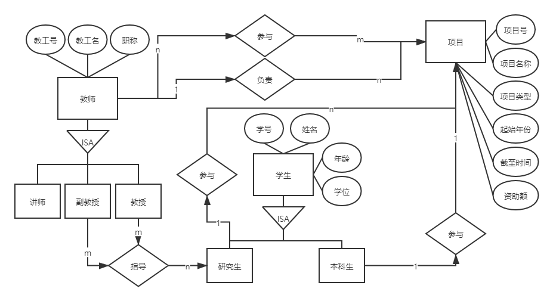

## 题目一：正向工程和逆向工程
```
什么是正向工程？什么是逆向工程？
```
- 正向工程：通过到实现语言的映射而把模型转换为代码的过程。 
- 逆向工程：通过从特定实现语言的映射而把代码转换为模型的过程。
```
列举聚集、弱实体、细化/泛化的实用例子（不要同讲义上的相同）
```
- 聚集：课题组包含许多成员,但是每个成员又可以是另一个课题组的成员,即部分可以参加多个整体,为聚集。
- 弱实体：一个实体的存在必须以另一实体的存在为前提，前者就称为弱实体。如在人事管理系统中，职工子女的信息就是以职工的存在为前提的，子女实体是弱实体，子女与职工的联系是一种依赖联系。在ER图中用双线框表示弱实体。用箭头表示依赖联系。
- 细化/泛化：科目可分为文科和理科；文学学位和理学学位都称为学位。
```
已知有如下关系模式：E1(_ a1,a2,a3),E2(_ a3,a4),E3(_ a5,a6),E4(_ a3,_ a5,a7),其中带下划线的属性表示为所在关系模式的主码。试画出相应的E-R图，使得可以从该E-R图推导出上述关系模式。
```

## 题目二：关系数据库设计
```
- 考虑设计一个关系数据库，它要存储以下信息：
    - 教师有教工号、教工号、职称；项目有项目号、项目名称、项目类型、起始年份、截至时间、资助额；学生有学号、学生名、年龄、学位。
    - 学生分为本科生和研究生，老师按职称可以分为讲师、副教授、教授，副教授以上的职称可以作为研究生的导师。
    - 一个教工可以负责多个项目；每个项目只能有一个负责人；一个老师可以参与多个项目；一个本科生只能参与一个项目，一个研究生学生可以参与多个项目；一个项目可以有多个学生和老师参与。
```
