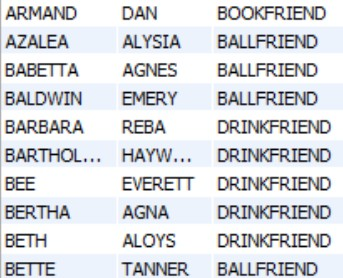

# Acquaintance 数据表设计与使用
```
考虑⼀个熟⼈表acquaintance (friend1, friend2, class)，表示friend1和friend2是朋友，
class表示类别，⽐如“书友”，“球友”，“酒友”等等。
```

1. 定义语句
```sql
CREATE TABLE `acquaintance` (   
  `id` INT NOT NULL AUTO_INCREMENT,   
  `friend1` VARCHAR(50) NOT NULL,   
  `friend2` VARCHAR(50) NOT NULL,   
  `class` VARCHAR(50) NOT NULL,   
  PRIMARY KEY (`id`));
```
2. 在 MySQL 数据库中新建此表
```
  mysql> SHOW FULL COLUMNS FROM acquaintance
    -> ;
+---------+-------------+-------------------+------+-----+---------+----------------+---------------------------------+---------+
| Field   | Type        | Collation         | Null | Key | Default | Extra          | Privileges                      | Comment |
+---------+-------------+-------------------+------+-----+---------+----------------+---------------------------------+---------+
| id      | int(11)     | NULL              | NO   | PRI | NULL    | auto_increment | select,insert,update,references |         |
| friend1 | varchar(50) | latin1_swedish_ci | NO   |     | NULL    |                | select,insert,update,references |         |
| friend2 | varchar(50) | latin1_swedish_ci | NO   |     | NULL    |                | select,insert,update,references |         |
| class   | varchar(50) | latin1_swedish_ci | NO   |     | NULL    |                | select,insert,update,references |         |
+---------+-------------+-------------------+------+-----+---------+----------------+---------------------------------+---------+
```
3. 生成测试数据  
